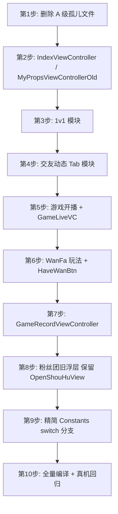

# 实力直播 — 无用 Activity（ViewController）与 Constants 清理分析

> 更新日期：2026-06-22  
> 分析基准：[Constants.m](../lvyou/Common/Constants.m) 当前配置值  
> 说明：iOS 项目中常说的「Activity」对应 `UIViewController` 及其关联的 `.h/.m/.xib` 文件。  
> 追溯原则：**「类名被 import」≠「运行时可达」**，以 `[[Class alloc] init]`、IBAction、`switch(Constants)` 及当前配置是否走得到为准。

---

## 一、当前生效配置摘要

根据 `Constants.m` 当前取值，App 实际运行形态如下：

| 配置项 | 当前值 | 含义 |
|--------|--------|------|
| `HomePageType` | **10** | 首页 = 推荐（关注 / 贵族推荐 / 热门 / 最新 / 小视频） |
| `TabTwoType` | **6** | 第 2 Tab = 充值 |
| `TabThreeType` | **1** | 第 4 Tab = 商城 |
| `BeginLiveType` | **3** | 中间开播按钮 = 小视频 + 直播（**不走**游戏开播） |
| `AttentionPage` | **2** | MH 关注样式（`HomePageType=10` 下推荐页不走 `attentionPage` 分支） |
| `OneToOneType` | **2** | 关闭 1v1 |
| `ShouHuType` | **2** | 关闭粉丝团按钮显隐（旧浮层链已断，见 3.8） |
| `GameListType` | **2** | 关闭游戏账单 |
| `GuiZuType` | **1** | 开启贵族 |
| `PKType` | **1** | 开启 PK |
| `HaveWanBtn` | **1** | 配置为开，但玩法按钮 **实际永不显示**（见 3.6） |
| `HaveGameType` | **1** | 仅注释残留，**等同废弃**（见 3.5） |
| `BeginLiveShow` | **3** | **零引用**，从未被任何 `.m` 读取 |
| `PushToList` | **3** | 首页右上角 = 消息入口 |
| `ThirdLoginType` | **4** | 仅微信登录 |
| `MiMaAndPayType` | **2** | 不显示密码房 / 收费房 |
| `GongHui` | **1** | 工会功能开启 |

### 当前 Tab 结构

```
Tab1 首页(LiveViewController)  →  推荐模式
Tab2 充值                       →  XYUserBalanceApperPayController
Tab3 开播(中间按钮)              →  小视频 / 直播 弹窗
Tab4 商城                       →  XYFindStoreViewController
Tab5 我的                       →  UserViewController
```

### 首页（HomePageType=10）实际加载的子页面

| 序号 | ViewController | 用途 |
|------|----------------|------|
| 0 | `LSLatestViewController` | 关注列表 `live/list/follow` |
| 1 | `LSLatestViewController` | 贵族推荐 `guizhu/recommendList` |
| 2 | `LSHotViewController` | 热门直播 |
| 3 | `LSLatestViewController` | 最新 |
| 4 | `SVideoHotVC` | 小视频 |

---

## 二、删除风险分级说明

| 等级 | 含义 |
|------|------|
| **A — 高信心** | 未编入 Xcode 工程，或工程内零外部引用，删除后不影响编译 |
| **B — 中信心** | 已编入工程，但仅被「当前未启用的 Constants 分支」或死链引用，运行时走不到 |
| **C — 低信心** | 有间接引用或需同步改 `switch` 分支，删前需全量编译验证 |

---

## 三、建议删除文件清单

### 3.1 【A 级】孤儿 / 重复文件（未编入 Xcode）

以下文件在磁盘存在，但 **不在 `project.pbxproj` 中**，属于历史残留副本：

| 文件 | 说明 |
|------|------|
| `lvyou/Classes/Live/Controller/SubVC/BannerWebViewControlleraa.m` | 与 `BannerWebViewController.m` 重复 |
| `lvyou/Classes/Rest/Controller/GuiZuVC/GuiZuViewControlleraa.h/.m/.xib` | 与 `GuiZuViewController` 重复 |

**建议：直接删除，无需改 pbxproj。**

---

### 3.2 【A 级】工程内零引用 ViewController

| 文件 | 证据 |
|------|------|
| `lvyou/Classes/Main/Controller/IndexViewController.h/.m` | 全工程无 `[[IndexViewController alloc]` |
| `lvyou/Classes/User/Controller/MyPropsViewControllerOld.h/.m` | 仅被 `UserViewController.m` import，从未 alloc |

**同步修改：** 从 `UserViewController.m` 移除 `#import "MyPropsViewControllerOld.h"`。

---

### 3.3 【B 级】1v1 模块（`OneToOneType = 2` 已关闭）

`FindViewController` 只在 `TabTwoType = 2（1v1）` 时作为 Tab 根控制器，当前 `TabTwoType = 6` 不会进入。

| 文件 |
|------|
| `lvyou/Classes/Find/Controller/FindViewController.h/.m/.xib` |
| `lvyou/Classes/Find/Controller/FindSubviewVC/OneToOneHotViewController.h/.m/.xib` |
| `lvyou/Classes/Find/Controller/FindSubviewVC/OneToOneHotDetailViewController.h/.m/.xib` |
| `lvyou/Classes/Find/View/FindHotView/` 整个目录 |

**同步修改：**
- `BaseTabBarController.m`：删除 `TabTwoType = 2` 分支及 `#import "FindViewController.h"`
- `UserViewController.m` / `XYUserMissionViewController.m`：删除 `OneToOneType` ON 分支

**向上追溯：**

```
BaseTabBarController tabBarController:shouldSelect:
    └── switch (TabTwoType)  当前 = 6（充值）
            [DEAD] case 2: [[FindViewController alloc] init]
                    └── OneToOneHotViewController → OneToOneHotDetailViewController
```

---

### 3.4 【B 级】交友 / 动态 Tab 模块（`XYFindAndMakingViewController`）

仅在 `TabTwoType=5` 或 `TabThreeType=2` 作为 Tab 根页面时使用，当前均未启用。

| 文件 |
|------|
| `lvyou/Classes/Find/Controller/XYFindAndMakingViewController.h/.m/.xib` |
| `lvyou/Classes/Find/Controller/MakingFriendsViewController.h/.m/.xib` |
| `lvyou/Classes/Find/Controller/VisitorRecordViewController.h/.m/.xib` |
| `lvyou/Classes/Find/Controller/VisitorViewController.h/.m/.xib` |
| `lvyou/Classes/Find/Controller/FindCategoryVC/` 整个目录 |
| `lvyou/Classes/Find/View/MakingCollection/`、`MakingTableViewCell/` |
| `lvyou/Classes/Find/Controller/HomeScreenViewController.h/.m/.xib`（仅此处引用） |

**勿删（仍有其他入口）：**
- `XYFindTrendsViewController`、`HomeSearchViewController`（`LiveViewController` 搜索仍用）

---

### 3.5 【B 级】游戏开播 / 游戏首页 Tab（`BeginLiveType = 3`，`HomePageType = 10`）

> **重要区分：** 项目里「游戏」有多套概念，不要混删。

| 概念 | 配置 | 当前状态 |
|------|------|----------|
| **游戏开播**（播游戏 + 直播） | `BeginLiveType` case 4/6 | `BeginLiveType=3` 仅走「小视频 + 直播」，**不会调用** `playGameWith` |
| **游戏首页 Tab** | `HomePageType=6` | 当前 `HomePageType=10`，**不会加载** `GameLiveVC` |
| **小游戏配置开关** | `HaveGameType` | 仅在 `XYGameViewerUserLiveViewController.m` 中**已整段注释** |
| **开播页游戏选项** | `BeginLiveShow=3` | **全工程零引用** |
| **观众主直播间** | — | `XYGameViewerUserLiveViewController` 名字含 Game，但是**主直播间 VC**，**不能删** |

#### 建议删除 — 游戏开播链路

| 文件 |
|------|
| `lvyou/Classes/Rest/Controller/BeginGameLiveViewController.h/.m/.xib` |
| `lvyou/Classes/Rest/Controller/SelectGameViewController.h/.m/.xib` |
| `lvyou/Classes/Rest/Model/SelectGameModel.h/.m` |

**同步修改 `BaseTabBarController.m`：**
- 删除 `#import "BeginGameLiveViewController.h"`
- 删除 `playGameWith:` 方法
- `BeginLiveType` 的 `switch` 只保留 case 3，删除 case 1/2/4/5/6

#### 建议删除 — 游戏首页 Tab

| 文件 |
|------|
| `lvyou/Classes/Live/Controller/GameLiveVC.h/.m/.xib` |
| `lvyou/Classes/Live/View/GameView/GameLiveCCell.h/.m/.xib` |

**向上追溯：**

```
【游戏开播 — DEAD】
BaseTabBarController → switch (BeginLiveType)  当前 = 3
    [ACTIVE] case 3: HyPopMenuView → VideoAction / BeginLiveWith
    [DEAD] case 4/6: playGameWith: → BeginGameLiveViewController → SelectGameViewController

【游戏首页 Tab — DEAD】
LiveViewController → switch (HomePageType)  当前 = 10 ≠ 6
    [DEAD] case 6: [[GameLiveVC alloc] init]
```

#### 必须保留（勿与上表混淆）

| 模块 | 原因 |
|------|------|
| `GameModel` / `LiveGameModel` | `BaseLiveViewController` 礼物/房间消息解析 |
| `XYGameViewerUserLiveViewController` | 观众端主直播间 |
| `XYBeginLiveViewController` | `BeginLiveType=3` 正常开播入口 |
| `GameListModel` / `XYHeroViewController` | 英雄榜等业务 |

---

### 3.6 【B 级】直播间玩法 WanFa（`HaveWanBtn=1` 但入口已关）

**为何判定为死链：**

| 位置 | 现象 |
|------|------|
| `CameraViewController.xib` / `XYGameViewerUserLiveViewController.xib` | `wanBtn` 初始 `hidden="YES"` |
| `CameraViewController.m` `downTheBtn`（约 2167 行） | `// self.wanBtn.hidden=NO;` **已注释** |
| `XYGameViewerUserLiveViewController.m` `downTheBtn`（约 2062 行） | 同上 |
| 观众端 `viewDidLoad` / 清屏手势 | 多处 `self.wanBtn.hidden=YES` |
| `BaseLiveViewController.m` `showBtn`（约 241 行） | 仍有 `wanBtn.hidden=NO`，但 `showBtn` **仅**由 `hideFullGame` 调用；全屏游戏路径在当前配置下基本不可达 |

`playAction` / `requestWanFaList` / `sendWanIDWith` 等逻辑虽仍存在，但无 UI 入口；`wan_toshow` / `wan_jujue` 等 FMS 回调可一并移除。

#### 建议删除文件

| 文件 |
|------|
| `lvyou/Classes/Rest/Controller/WanFaVC/WanFaViewController.h/.m/.xib` |
| `lvyou/Classes/Rest/Controller/WanFaVC/EditWanFaViewController.h/.m/.xib` |
| `lvyou/Classes/Rest/Controller/WanFaVC/AddWanFaViewController.h/.m/.xib` |
| `lvyou/Classes/Rest/Controller/WanFaVC/WanFaView.h/.m` |
| `lvyou/Classes/Rest/Controller/WanFaVC/TanKuangView.h/.m` |
| `lvyou/Classes/Rest/Controller/WanFaVC/TanKuangViewTwo.h/.m` |
| `lvyou/Classes/Rest/Controller/WanFaVC/RefuseTanKuangView.h/.m` |
| `lvyou/Classes/Rest/Controller/WanFaVC/WanFaCell/WanFaCell.h/.m/.xib` |
| `lvyou/Classes/Rest/Controller/WanFaVC/WanFaCell/ViewerWanFaCell.h/.m/.xib` |
| `lvyou/Classes/Rest/Model/WanFaModel.h/.m` |

#### 同步修改（勿动 PK 相关 `PKTanKuangOne/Two`）

| 文件 | 需删/改内容 |
|------|-------------|
| `Constants.m` / `Constants.h` | 删除 `HaveWanBtn` 及枚举 |
| `BaseLiveViewController.h/.m` | WanFa 相关 import、属性、方法、`HaveWanBtn` switch |
| `CameraViewController.m` | `playAction`、`wan_toshow` 分支、`HaveWanBtn` switch |
| `XYGameViewerUserLiveViewController.m/.h` | `playAction`、`requestWanFaList`、`initWanFaView`、`wan_jujue` 等 |
| 两个直播间 xib | 移除 `wanBtn` 及 `playAction` 连线（可选） |

**向上追溯：**

```
wanBtn（xib 默认 hidden=YES）
    └── downTheBtn：// wanBtn.hidden=NO 已注释
            [DEAD] playAction → WanFaViewController / requestWanFaList → WanFaView
            [DEAD] FMS wan_toshow / wan_jujue → TanKuangViewTwo / RefuseTanKuangView
```

---

### 3.7 【B 级】游戏账单（`GameListType = 2` 已关闭）

| 文件 |
|------|
| `lvyou/Classes/User/Controller/RecordVC/SubVC/GameRecordViewController.h/.m` |

**同步修改：** `XYCheckController.m` 删除 `GameListType` switch 及 `gameRecord` 逻辑。

**说明：** `XYCheckController` 账单页本身仍活跃，只删游戏账单子页。

```
UserViewController → [[XYCheckController alloc] init]   ← 活跃
    └── switch (GameListType)  当前 = 2（关）
            [DEAD] case ON: GameRecordViewController
```

---

### 3.8 【B 级】粉丝团旧浮层（`initShouHuPeople` 无调用方）

`ShouHuType=2` 已关闭粉丝团按钮，且 **`initShouHuPeople` 全工程无任何调用方**，旧浮层链整条断开。

#### 建议删除

| 文件 |
|------|
| `lvyou/Classes/Rest/Controller/ShouHuVC/ShouHuViewController.h/.m/.xib` |
| `lvyou/Classes/Rest/View/ShouHuView/ShouHuView.h/.m` |
| `lvyou/Classes/Rest/View/ShouHuView/ShouHuDetailView.h/.m` |

**同步修改 `BaseLiveViewController.m/.h`：**
- 删除 `initShouHuPeople`、`showShouHuView`、`kaitongClick`
- 删除 `#import "ShouHuViewController.h"` 及 `ShouHuView` 相关

#### 必须保留

| 文件 | 原因 |
|------|------|
| `OpenShouHuView.h/.m/.xib` | `XYGameViewerUserLiveViewController` 观众端开通守护弹窗仍在使用 |

**向上追溯：**

```
[DEAD] initShouHuPeople（无调用方）
    └── showShouHuView → ShouHuView → kaitongClick → ShouHuViewController

[ACTIVE] XYGameViewerUserLiveViewController
    └── loadNibNamed:@"OpenShouHuView"   ← 保留
```

---

### 3.9 【C 级】仍有其他入口 — 暂不删

| ViewController | 仍被使用的原因 |
|----------------|----------------|
| `MessageViewController` | `TabThreeType=5` 时作 Tab；消息体系仍需要 |
| `ConversationViewController` | 首页消息按钮（`PushToList=3`）、直播间私信 |
| `XYListViewController` | 首页排行榜 push、直播间内跳转 |
| `SVideoHotVC` | 首页推荐第 5 页、开播关联 |
| `XYFindTrendsViewController` | 动态相关跳转 |
| `HomeSearchViewController` | `LiveViewController` 搜索入口 |
| `LSAttentionViewController` | `UserViewController` 个人中心关注列表 |
| `MyAttentionViewController` | 关注页 MH 样式（配置保留） |
| `LSHotViewController` / `LSLatestViewController` | 首页推荐核心页面 |
| `XYFindStoreViewController` | Tab4 商城 + Tab2 充值关联 |
| `BuyVIPViewController` / `BlueVIPViewController` | 商城、搜索、个人中心 VIP |
| `GongHuiViewController` | `GongHui=1`，开播/提现/认证校验 |
| `XYHuoDongViewController` | 活动榜单 |
| `OpenShouHuView` | 观众端开通守护（见 3.8） |
| `XYGameViewerUserLiveViewController` | 观众主直播间（删 WanFa 时只清引用，**勿删 VC**） |
| `XYCheckController` | 账单页活跃（只删 `GameRecordViewController` 子页） |

---

### 3.10 【C 级】引用极少、需人工确认后再删

| 文件 | 引用情况 |
|------|----------|
| `lvyou/Classes/Live/Controller/SubVC/ToyWebViewController.*` | 仅 `BannerWebViewControlleraa.m` 引用 |
| `lvyou/Classes/Rest/Controller/JoinRoomVC/PWDRoomVC.*` | `MiMaAndPayType=2` 密码房已关 |
| `lvyou/Classes/Live/Controller/SubVC/ListVC/XYCorpsListViewController.*` | 仅 xib 自引用 |
| `lvyou/Classes/Live/Controller/SubVC/ListVC/XYGiftStarListViewController.*` | 同上 |
| `lvyou/Classes/Live/Controller/SubVC/ListVC/XYCommonListViewController.*` | 同上 |
| `lvyou/Classes/Find/Controller/SubVC/XYFindSceneStoreViewController.*` | 仅 xib 自引用 |
| `lvyou/Classes/Live/Controller/SubVC/XYBecomeMemberViewController.*` | 仅 xib 自引用 |
| `lvyou/Classes/User/Controller/TuiGuangVC/TuiGuangVCViewController.*` | 仅 xib 自引用 |

---

### 3.11 全模块向上追溯总表（方法级 · 到 App 入口）

| 模块 | 顶层入口 | 配置门槛 | 当前是否可达 | 结论 |
|------|----------|----------|-------------|------|
| **A · IndexViewController** | 无 | — | 否 | 删 |
| **A · MyPropsViewControllerOld** | 仅 import | — | 否 | 删 |
| **A · Banner/GuiZu aa 副本** | 未编入 pbxproj | — | 否 | 删 |
| **B · 1v1** | `BaseTabBarController` Tab2 | `TabTwoType=2` | 否（=6） | 删整条链 |
| **B · 交友动态 Tab** | `BaseTabBarController` Tab2/4 | `TabTwoType=5` 或 `TabThreeType=2` | 否 | 删模块 |
| **B · 游戏开播** | 中间开播按钮 | `BeginLiveType` 4/6 | 否（=3） | 删 |
| **B · GameLiveVC** | `LiveViewController` 子页 | `HomePageType=6` | 否（=10） | 删 |
| **B · WanFa 玩法** | `wanBtn` + `playAction` | `HaveWanBtn=1` 但按钮永不显示 | 否 | 删 `WanFaVC/` + `HaveWanBtn` |
| **B · GameRecordVC** | `XYCheckController` | `GameListType=1` | 否（=2） | 删子页 |
| **B · ShouHu 旧浮层** | `initShouHuPeople` | 无调用方 | 否 | 删；**保留** `OpenShouHuView` |
| **C · GongHui 工会** | 开播/提现校验 | `GongHui=1` | **是** | **保留** |
| **C · OpenShouHuView** | 观众直播间 | — | **是** | **保留** |
| **C · ConversationVC** | 首页消息按钮 | `PushToList=3` | **是** | **保留** |
| **C · SVideoHotVC** | 推荐第 5 页 | `HomePageType=10` | **是** | **保留** |
| **C · XYCheckController** | 个人中心账单 | — | **是** | **保留**（只删游戏账单子页） |

---

## 四、Constants.m / Constants.h 精简建议

目标：**只保留当前生效值，删除多站点开关分支**。

### 4.1 第一步：保留当前生效的配置项

```
HaveOneList=7, HaveBannerInHot=1, PushToList=3,
ShowPeopleNum=1, ShowPeopleNumRest=2, GongHui=1, UpLoadPhoto=1,
GetBalance=2, AttentionPage=2,
SystemColor=3, ShowPKENDType=1, PKViewType=2, JueWeiType=2,
ExperienceType=2, UserLevel=1, VideoScrollType=1, RoomScrollType=1,
UserShopType=2, TabTwoType=6, HomePageType=10, TabThreeType=1,
LiveListType=1, SecretType=1, GuiZuType=1, GiftTagType=1,
FaceBeautifulType=2, PKType=1, HotRowType=1,
LoginBannerType=2, LiveBannerType=1, LoginPrivacyType=2,
ThirdLoginType=4, MiMaAndPayType=2, HotShowTwoOrBigImg=1,
ShowTagList=1, PersonType=1, BeginLiveType=3
```

> **已从保留列表移除（应直接删除或随分支精简）：**  
> `BeginLiveShow`、`HaveGameType`、`LastRowType`、`RocketType`（零引用）、`HaveWanBtn`（配置开但玩法按钮永不显示）、`ShowNew`/`ShowHot`（`HomePageType=10` 下不可达）。

### 4.2 第二步：可删除或硬编码为「关闭」的配置项

| 配置项 | 当前值 | 影响文件（主要） |
|--------|--------|------------------|
| `HaveBannerInVideo` | 2 关闭 | 直播间 banner |
| `HaveSearchBar` | 2 关闭 | `LiveViewController` 搜索栏 |
| `YaoQingClose` | 2 关闭 | 邀请码关闭按钮 |
| `HaveTagList` | 2 关闭 | 小视频分类 |
| `OneToOneType` | 2 关闭 | `UserViewController` 等 |
| `ShouHuType` | 2 关闭 | 粉丝团按钮显隐 |
| `GameListType` | 2 关闭 | `XYCheckController` 游戏账单 |
| `ShowPaiHangList` | 2 关闭 | 首页排行榜展示 |
| `ShowGameTagList` | 2 关闭 | 首页游戏分类 |
| `ChargeType` | 2 关闭 | `XYFindStoreViewController` |
| `ExperienceType` | 2 关闭 | `LiveViewController` 体验时间 |
| `ShowPeopleNumRest` | 2 关闭 | 休息中人数显示 |
| `LoginBannerType` | 2 关闭 | 登录页 banner |
| `LoginPrivacyType` | 2 关闭 | 登录页隐私条款 |

### 4.2.1 应从 Constants 直接删除（零引用或 UI 不可达）

| 配置项 | 原因 |
|--------|------|
| `BeginLiveShow` | 全工程无任何 `.m` 引用 |
| `HaveGameType` | `XYGameViewerUserLiveViewController.m` 中 switch 已全部注释 |
| `LastRowType` | 仅注释中出现，无有效逻辑 |
| `RocketType` | 仅存在于 `Constants.m/h`，全工程无引用 |
| `HaveWanBtn` | 配置=1，但 `downTheBtn` 中显示按钮代码已注释，玩法无 UI 入口 |

### 4.3 可删除的 `switch` 大分支（改代码，不是删文件）

| 文件 | 可删除的分支 |
|------|-------------|
| `BaseTabBarController.m` | `TabTwoType` case 1~5；`TabThreeType` case 2~5；`BeginLiveType` case 1,2,4,5,6 |
| `LiveViewController.m` | `HomePageType` case 1~9；`AttentionPage` case 1；`ShowNew`/`ShowHot` 相关 |
| `BaseLiveViewController.m` | `ShouHuType` case ON；`HaveWanBtn` switch；玩法相关方法；`GuiZuType` OFF 分支 |
| `CameraViewController.m` / `XYGameViewerUserLiveViewController.m` | `HaveWanBtn` switch；`playAction` / WanFa FMS 回调 |
| `XYCheckController.m` | `GameListType` case ON |

### 4.4 Tab 名称常量可精简

| 常量 | 是否使用 |
|------|----------|
| `LiveItemName`（首页） | 使用 |
| `ShopItemName`（商城） | Tab4 使用 |
| `UserItemName`（我的） | 使用 |
| `RestItemName` | 中间开播按钮 |
| `OneToOneItemName` | **未使用** |
| `ListItemName` / `RankItemName` | Tab 未启用 |
| `DetailItemName` / `VideoItemName` / `MessageItemName` | Tab 未启用 |

### 4.5 第三方配置可清理的空项

```
kwbAppKey, kwbScheme, kwbSecret   → 微博（ThirdLoginType=4 未使用）
kqqAppId, kqqScheme               → QQ（未使用）
MCH_ID, PARTNER_ID                → 微信支付商户（空）
DATAAPI, DATAAPITWO, CHAT 等      → 运行时由服务器下发，保留 key 即可
```

### 4.6 全部 NSInteger 配置项审查表（共 54 项）

图例：**生效** = 当前配置下会走进逻辑；**不可达** = 有代码但走不到；**零引用** = 无有效 `.m` 调用

| # | 配置项 | 当前值 | 主要引用 | 当前是否生效 | 处理建议 |
|---|--------|--------|----------|-------------|----------|
| 1 | `HaveOneList` | 7 | 榜单页 | 生效 | 保留，可写死 |
| 2 | `HaveBannerInVideo` | 2 关 | `SVideoHotVC` | 生效（OFF） | 删配置，硬编码关 |
| 3 | `HaveBannerInHot` | 1 开 | `LSHotViewController` | 生效 | 保留 |
| 4 | `HaveWanBtn` | 1 开 | 直播间 VC | **不可达** | **直接删除** + 删 `WanFaVC/` |
| 5 | `HaveSearchBar` | 2 关 | `LiveViewController` | 生效（OFF） | 删配置 |
| 6 | `PushToList` | 3 | `LiveViewController` | 生效 | 保留 |
| 7 | `ShowPeopleNum` | 1 | 首页/搜索 | 生效 | 保留 |
| 8 | `ShowPeopleNumRest` | 2 关 | 同上 | 生效（OFF） | 可简化 |
| 9 | `YaoQingClose` | 2 关 | `InviteView` | 生效（OFF） | 可删配置 |
| 10 | `GongHui` | 1 开 | 认证/开播校验 | 生效 | 保留 |
| 11 | `UpLoadPhoto` | 1 | `XYStatusApproveController` | 生效 | 保留 |
| 12 | `GetBalance` | 2 | 充值页 | 生效 | 保留 |
| 13 | `ShowNew` | 1 | `LiveViewController` | **不可达**（仅 HomePageType 1~9） | 随首页分支删除 |
| 14 | `ShowHot` | 1 | `LiveViewController` | **不可达** | 随首页分支删除 |
| 15 | `AttentionPage` | 2 | `LiveViewController` | 推荐页路径不可达 | 保留枚举或删 case 1 |
| 16 | `BeginLiveShow` | 3 | **无** | **零引用** | **直接删除** |
| 17 | `HaveTagList` | 2 关 | `SVideoHotVC` | 生效（OFF） | 可简化 |
| 18 | `SystemColor` | 3 | 房间公告 | 生效 | 保留 |
| 19 | `ShowPKENDType` | 1 | `PKView` | 生效 | 保留 |
| 20 | `PKViewType` | 2 | `PKView` | 生效 | 保留 |
| 21 | `JueWeiType` | 2 | 贵族相关 | 生效 | 保留 |
| 22 | `ExperienceType` | 2 关 | `LiveViewController` | 生效（OFF） | 可删整个 switch |
| 23 | `UserLevel` | 1 | 交友模块等 | 随 3.4 删模块后评估 | 保留/删 |
| 24 | `VideoScrollType` | 1 | 小视频 | 生效 | 保留 |
| 25 | `RoomScrollType` | 1 | 直播间滑动 | 生效 | 保留 |
| 26 | `UserShopType` | 2 | 商城布局 | 生效 | 保留 |
| 27 | `TabTwoType` | 6 | `BaseTabBarController` | 生效 | 保留，删 case 1~5 |
| 28 | `HomePageType` | 10 | `LiveViewController` | 生效 | 保留，删 case 1~9 |
| 29 | `ShowPaiHangList` | 2 关 | `XYListViewController` | 生效（OFF） | 可简化 |
| 30 | `TabThreeType` | 1 | `BaseTabBarController` | 生效 | 保留，删 case 2~5 |
| 31 | `ChargeType` | 2 关 | `XYFindStoreViewController` | 生效（OFF） | 可简化 |
| 32 | `ShowGameTagList` | 2 关 | `LSHotViewController` | 生效（OFF） | 可简化 |
| 33 | `LiveListType` | 1 | 榜单页 | 生效 | 保留 |
| 34 | `GameListType` | 2 关 | `XYCheckController` | 生效（OFF） | 删 `GameRecordViewController` |
| 35 | `SecretType` | 1 | 密码房 | 生效 | 保留 |
| 36 | `GuiZuType` | 1 | 直播间/搜索 | 生效 | 保留 |
| 37 | `OneToOneType` | 2 关 | 个人中心 | 生效（OFF） | 删配置 + 3.3 模块 |
| 38 | `GiftTagType` | 1 | 礼物面板 | 生效 | 保留 |
| 39 | `ShouHuType` | 2 关 | 粉丝团按钮 | 生效（隐藏） | 可删配置；旧浮层见 3.8 |
| 40 | `FaceBeautifulType` | 2 | 美颜 | 生效 | 保留 |
| 41 | `PKType` | 1 | PK | 生效 | 保留 |
| 42 | `HotRowType` | 1 | 首页列数 | 生效 | 保留 |
| 43 | `LastRowType` | 2 | **仅注释** | **零引用** | **直接删除** |
| 44 | `LoginBannerType` | 2 关 | 登录页 | 生效（OFF） | 可简化 |
| 45 | `LiveBannerType` | 1 | 直播间飘屏 | 生效 | 保留 |
| 46 | `LoginPrivacyType` | 2 关 | 登录页 | 生效（OFF） | 可简化 |
| 47 | `ThirdLoginType` | 4 | 分享/登录 | 生效 | 保留 |
| 48 | `MiMaAndPayType` | 2 关 | 密码/收费房 | 生效（OFF） | 可简化 |
| 49 | `HotShowTwoOrBigImg` | 1 | 首页图尺寸 | 生效 | 保留 |
| 50 | `ShowTagList` | 1 | 首页分类 | 生效 | 保留 |
| 51 | `HaveGameType` | 1 | **仅注释** | **零引用** | **直接删除** |
| 52 | `PersonType` | 1 | 个人中心 | 生效 | 保留 |
| 53 | `RocketType` | 2 | **无** | **零引用** | **直接删除** |
| 54 | `BeginLiveType` | 3 | `BaseTabBarController` | 生效 | 保留，删 case 1/2/4/5/6 |

#### 汇总统计（54 项）

| 类别 | 数量 | 说明 |
|------|------|------|
| 保留并写死当前值 | 约 28 项 | 直播间、首页推荐、充值、PK、贵族等 |
| 关闭项可删 switch 分支 | 约 16 项 | 当前值为「2/关」 |
| 当前配置下代码不可达 | 约 4 项 | `ShowNew`、`ShowHot`、`HaveWanBtn`、`AttentionPage` 部分路径 |
| 应直接从 Constants 删除 | **5 项** | `BeginLiveShow`、`HaveGameType`、`LastRowType`、`RocketType`、`HaveWanBtn` |

---

## 五、推荐执行顺序



每步完成后：
1. 从 `lvyou.xcodeproj/project.pbxproj` 移除文件引用
2. `Cmd + B` 全量编译
3. 验证：首页推荐、充值、开播、商城、我的、直播间、PK、贵族、开通守护

---

## 六、统计汇总

| 类别 | 文件约数 | 风险 |
|------|----------|------|
| A 级孤儿 / 零引用 | ~8 个 | 低 |
| B 级 1v1 模块 | ~15 个 | 中 |
| B 级 交友动态 Tab | ~25 个 | 中 |
| B 级 游戏开播 + 游戏 Tab | ~12 个 | 中 |
| B 级 WanFa 玩法 | ~23 个 | 中 |
| B 级 游戏账单 | 2 个 | 中 |
| B 级 粉丝团旧浮层 | ~6 个 | 中（**保留** `OpenShouHuView`） |
| C 级 待确认 | ~15 个 | 高 |
| Constants 分支精简 | 改 ~12 个 .m | 中 |

**第一批（A 级）：约 8 个文件，零业务风险。**  
**第二批（B 级）：约 83 个文件，需同步改 8~10 个调用方。**

---

## 七、请你确认

请逐项确认后回复：

- [ ] **同意删除 A 级**（3.1 + 3.2）
- [ ] **同意删除 B 级 1v1 模块**（3.3）
- [ ] **同意删除 B 级 交友动态 Tab 模块**（3.4）
- [ ] **同意删除 B 级 游戏开播 + GameLiveVC**（3.5）
- [ ] **同意删除 B 级 WanFa 玩法 + HaveWanBtn**（3.6）
- [ ] **同意删除 B 级 游戏账单**（3.7）
- [ ] **同意删除 B 级 粉丝团旧浮层**（3.8，**保留** `OpenShouHuView`）
- [ ] **同意精简 Constants**（第四节）
- [ ] **C 级文件暂不处理**

也可指定范围，例如「只删 A 级」或「A + 指定 B 级小节」，确认后再执行代码删除。

---

*本文档由代码静态分析生成；删除 C 级文件前建议再跑一次全局搜索确认。*
